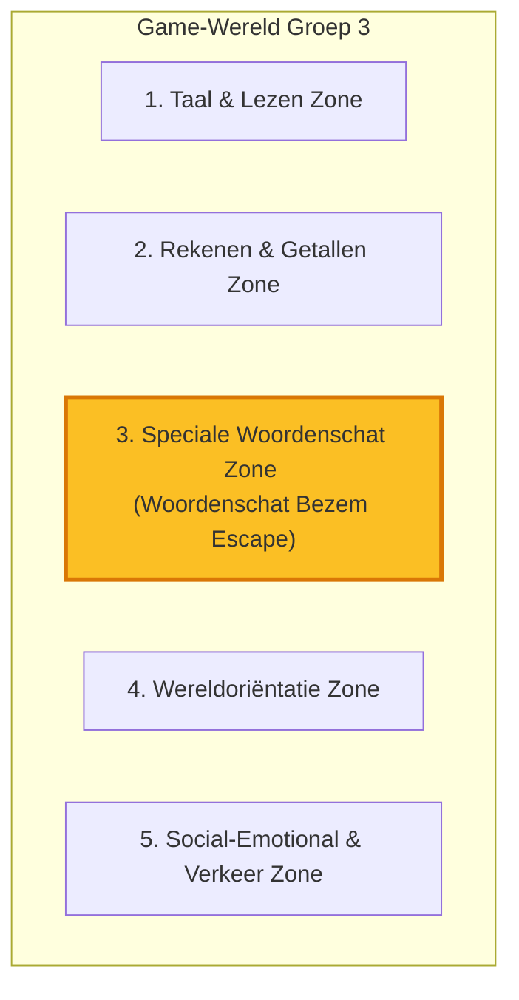

# Analyse Leerdoelen Groep 3 (Nederlands Basisonderwijs) - Index

Welkom bij de uitgebreide analyse van de leerdoelen en thema's voor **Groep 3** in Nederland (kinderen van 6-7 jaar). Deze analyse is opgesteld vanuit het perspectief van een professionele game UX- en curriculumontwerper, met als doel de doelen direct te vertalen naar **interactieve Game Zones**.

Om de leesbaarheid optimaal te houden, is deze analyse opgedeeld in de volgende documenten:

---

## 🗺️ Overzicht van de Game Zones

De leerdoelen van Groep 3 zijn gecategoriseerd en verdeeld over **5 afgebakende zones** binnen ons gameplatform:

---

## 📂 Gedetailleerde Analyses per Zone

Klik op de onderstaande links om de gedetailleerde leerdoelen (minimaal en maximaal te behalen doelen per eind Groep 3) per zone te bekijken:

### 1. 📖 [Taal & Lezen Zone](./groep3_zone_language.md)

- **Inhoud:** Technisch lezen (AVI-niveaus), begrijpend lezen, spelling, en zinopbouw.
- **Doel:** Van klank-tekenkoppeling naar vloeiend lezen van korte zinnen.

### 2. 🧮 [Rekenen & Getallen Zone](./groep3_zone_math.md)

- **Inhoud:** Getalbegrip tot 100, optellen/aftrekken tot 20, klokkijken, en ruimtelijk inzicht.
- **Doel:** Automatiseren van sommen onder de 10 en vlot rekenen tot 20.

### 3. 🎯 [Speciale Woordenschat Zone (Speciaal voor jouw zoon!)](./groep3_zone_vocabulary_special.md)

- **Inhoud:** Actieve woordenschat, passieve woordenschat, ruimtelijke begrippen (voorzetsels), en luistervaardigheid.
- **Sleutelgame:** Speciaal voor deze zone is de game **`woordenschat-bezem-escape`** ontwikkeld om spelenderwijs de actieve woordenschat te vergroten door middel van spraaksturing en sticker-plaatsing.

### 4. 🌍 [Wereldoriëntatie Zone](./groep3_zone_world_orientation.md)

- **Inhoud:** Seizoenen, natuur, dieren, tijd/kalender, en dagelijkse verschijnselen.
- **Doel:** Begrijpen van de wereld om hen heen en biologische basisconcepten.

---

## 🎓 Wat verwacht de school aan het einde van Groep 3? (Samenvatting)

Scholen in Nederland toetsen de voortgang via het **Cito-leerlingvolgsysteem**.

| Vaardigheid         | Minimale Verwachting (Basisstof / Niveau E)                                          | Maximale Verwachting (Streefdoel / Niveau A)                                                          |
| :------------------ | :----------------------------------------------------------------------------------- | :---------------------------------------------------------------------------------------------------- |
| **Technisch Lezen** | Behalen van **AVI-Start** / **AVI-M3** (lezen van simpele eenlettergrepige woorden). | Behalen van **AVI-E3** of **AVI-M4** (vloeiend lezen van langere zinnen met samengestelde woorden).   |
| **Spelling**        | Foutloos spellen van klankzuivere woorden (MKM zoals _kat_, _bos_).                  | Spellen van woorden met medeklinker-combinaties (_strand_, _feest_) en verkleinwoorden.               |
| **Rekenen**         | Tellen tot 100, sommen vlot oplossen tot 10 en met steunmatiaal tot 20.              | Volledig geautomatiseerd optellen/aftrekken tot 20 (zonder vingers/blokjes), klokkijken (kwartieren). |
| **Woordenschat**    | Passieve kennis van ± 3.200 alledaagse woorden.                                      | Actieve beheersing van **> 5.000 woorden**, inclusief complexe relatie- en positiewoorden.            |
