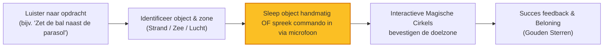

# Speciale Zone: Woordenschat & Ruimtelijk Inzicht

Deze zone is van cruciaal belang voor de taalontwikkeling en luistervaardigheid van het kind. Een brede actieve woordenschat helpt bij het begrijpen van instructies in de klas en verhoogt het zelfvertrouwen. 

**Speciaal voor deze zone is de game `woordenschat-bezem-escape` ontworpen!**

---

## 1. De Leerdoelen: Woordenschat & Concepten

### 🗣️ Woordenschat Omvang & Beheersing
* **Minimale Verwachting (Basis):**
  - Passieve kennis van ± 3.200 woorden. Dit betekent dat het kind het woord herkent wanneer het wordt voorgelezen, maar het zelf nog niet actief gebruikt.
  - Begrijpt basiscategorieën (dieren, voertuigen, meubels).
* **Maximale Verwachting (Streefdoel):**
  - Actieve en passieve beheersing van **meer dan 5.000 woorden**.
  - Het kind kan zelfstandig woorden benoemen, synoniemen herkennen, en details omschrijven.

### 🗺️ Ruimtelijke Voorzetsels & Relaties (Spatial Concepts)
Dit zijn woorden die de positie van een object ten opzichte van iets anders beschrijven. Dit is een belangrijk struikelblok in Groep 3.

* **De sleutelwoorden die beheerst moeten worden:**
  - *Boven* en *Onder*
  - *Links* en *Rechts*
  - *In* en *Op*
  - *Naast* en *Tussen*
  - *Dichtbij* en *Ver weg*
  - *Midden*

---

## 2. Waarom `woordenschat-bezem-escape` perfect aansluit

De game **`woordenschat-bezem-escape`** is specifiek ontworpen om dit leerdoel actief te trainen. In plaats van passief plaatjes aan te klikken, stimuleert deze game de actieve taalproductie en het luisterbegrip door de volgende mechanismen:

### Belangrijkste leerfuncties in de game:
1. **Actief Spreken (Zeg & Zet):**
   - Door de microfoon-functionaliteit leert het kind de hele zin hardop uit te spreken (*"Zet de boot links in de zee"*). Dit traint de actieve uitspraak en zinsbouw.
2. **Begrijpend Luisteren:**
   - De ingesproken opdrachten dwingen het kind om nauwkeurig te luisteren naar voorzetsels (*tussen, naast, dichtbij*) en deze direct visueel toe te passen.
3. **Visuele Scaffolding:**
   - De roterende magische ringen en de subtiele zonnestralen lichten op om het kind visueel te begeleiden bij foutieve of moeilijke plaatsingen, waardoor frustratie wordt voorkomen en het leren wordt versterkt.
