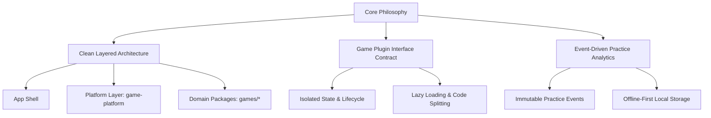

# 🏛️ Chapter 1: Executive Summary & Strategic Vision

## 1.1 Context & Background

**Game Wereld** is a digital educational platform designed for young children (ages 4–8) to learn vocabulary, spatial orientation, counting, and early language skills through interactive mini-games. The flagship game, **Strand Bezem Escape**, combines visual object placement, speech recognition, and video instructions to create an immersive learning environment.

As the scope of Game Wereld expands to include dozens of mini-games across multiple learning domains (mathematics, language, motor skills, social-emotional learning), the technical foundation must evolve from a single-app structure into a **scalable, modular micro-game platform**.

---

## 1.2 Strategic Architectural Goals

1. **Plug-and-Play Game Architecture**:
   Adding a new educational game must be as simple as dropping a self-contained game folder into `src/app/games/` and registering its metadata. Games must not leak state or logic into the global application shell.

2. **Strict Universal Modular Boundaries (Max 250 Lines Rule)**:
   Every file in the codebase—whether a React presenter (`.tsx`), custom hook (`.ts`), or logic utility (`.ts`)—must strictly adhere to a **maximum limit of 250 lines of code**. Large components or hooks must be decomposed into single-responsibility sub-modules.

3. **Decoupled Application & Domain State**:
   Global application state (active child profile, global volume, audio toggles) must be cleanly decoupled from game-specific state (active round, drag physics, speech recognition status).

4. **Event-Driven Educational Analytics Engine**:
   Child practice sessions must emit standardized, immutable `PracticeEvent` data. Analytics dashboards for parents and teachers must be dynamically derived from these events rather than relying on static percentages or fragile ad-hoc fields.

5. **Child-First UX & Accessibility**:
   The user interface must cater to pre-literate or early-reading children through visual cues, speech synthesis, large touch targets (minimum 48x48px), and zero clutter.

---

## 1.3 Core Architectural Philosophy

Our proposed architecture relies on three foundational pillars:

### Pillar 1: Clean Layered Architecture
Strict uni-directional dependency flow. Higher-level modules (App Shell) consume lower-level platform modules (`game-platform`). Game packages are isolated domains that communicate with the platform via explicit interfaces.

### Pillar 2: Plugin-Based Game Registration
Games are treated as standalone micro-applications conforming to an `IGamePlugin` contract. This enables independent development, isolated testing, and dynamic lazy loading.

### Pillar 3: Event-Driven Progress & Analytics
Instead of mutating state directly in database records during gameplay, games emit fine-grained practice events (`PracticeEvent`). This preserves historical context and allows flexible reporting across themes, difficulties, and timeframes.
