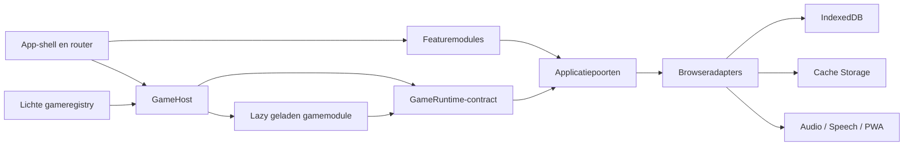

# 1. Samenvatting en besluit

## 1.1 Aanleiding

Game Wereld is nu een client-side React-app voor jonge kinderen, met profielkeuze, instellingen, voortgang, PWA-functionaliteit en één inhoudelijk uitgewerkte game: `magisch-strand-avontuur` (Magisch Strand Avontuur). De repository bevat al goede bouwstenen voor een platformlaag en featuremappen, maar de technische kwaliteitsbasis en de datastromen zijn nog niet consistent genoeg om veilig meerdere games toe te voegen.

Het eerdere voorstel koos direct voor “Clean Architecture”, drie globale stores, een plugin-engine en event-driven analytics. Die richting bevat bruikbare ideeën, maar maakt drie fouten:

1. het veronderstelt schaalproblemen die nog niet bewezen zijn;
2. het presenteert toekomstige onderdelen alsof ze al bestaan of automatisch voordelen leveren;
3. het maakt kwaliteit afhankelijk van regels zoals maximaal 250 regels per bestand, terwijl typeveiligheid, tests en importgrenzen niet worden afgedwongen.

## 1.2 Het besluit

We kiezen voor een **offline-first modulaire monoliet**, georganiseerd per bedrijfsfunctie en per game. De architectuur heeft vijf dragende onderdelen:

1. **App-shell** — routing, bootstrapping, profielselectie en het hosten van games.
2. **Featuremodules** — profielen, catalogus, instellingen en voortgang, ieder met eigen UI, toepassing en data-interface.
3. **Gamemodules** — zelfstandig testbare domeinen met manifest, content, spelregels, UI en assets.
4. **Platformadapters** — IndexedDB, Cache Storage, audio, spraak, klok, id-generatie en foutregistratie.
5. **Kwaliteitsstraat** — typecheck, lint, architectuurregels, tests, build- en assetbudgetten in CI.

## 1.3 Wat we expliciet niet bouwen

- Geen microservices of backend zolang data niet tussen apparaten of begeleiders hoeft te synchroniseren.
- Geen monorepo zolang één team en één deployment de modules samen uitbrengen.
- Geen runtime-pluginmarkt of remote code loading; alle games worden tijdens de build gekend en gecontroleerd.
- Geen universele game-engine die uiteenlopende spelmechanieken in één abstractie dwingt.
- Geen Redux/Zustand als standaardreactie op globale state; state krijgt eerst een duidelijke eigenaar en levensduur.
- Geen volledige event-sourcingarchitectuur. Alleen oefenobservaties zijn append-only; profielen en instellingen blijven gewone records.

Deze terughoudendheid is bewust: iedere abstractie moet aantoonbaar twee bestaande implementaties vereenvoudigen of een harde systeemgrens beschermen.

## 1.4 Beoogde uitkomsten

Na uitvoering van dit voorstel:

- blokkeert CI op TypeScript-fouten, grensoverschrijdende imports en falende tests;
- bevat de eerste app-download geen code en assetreferenties van een niet-geopende game;
- is er één bron van waarheid voor game-id en catalogusmetadata;
- kan een game niet rechtstreeks profielcontext, `localStorage` of browser-speech benaderen;
- blijven oefengegevens uitlegbaar, migreerbaar, verwijderbaar en lokaal;
- zijn fouten reproduceerbaar via een privacyveilig diagnostiekbestand en Playwright-traces;
- kan een tweede game worden toegevoegd zonder routes, profielopslag of dashboardlogica aan te passen.

## 1.5 Succescriteria

De architectuur is pas geslaagd wanneer de volgende scenario's aantoonbaar werken:

1. Een schone checkout voert `npm run check` en `npm run build` succesvol uit.
2. Een nieuwe voorbeeldgame registreert zich met één registry-entry en slaagt voor contracttests.
3. Een fout in een game toont een herstelbaar gamescherm zonder de app-shell neer te halen.
4. Een schema-upgrade behoudt bestaande profielen en oefengegevens of meldt herstelbaar dat migratie niet kan.
5. Een kind kan een eerder gedownloade wereld offline starten na een expliciete offline-beschikbaarheidscontrole.
6. Verwijderen van een profiel verwijdert alle instellingen, sessies, events en projecties van dat profiel.
7. De voortgangsweergave kan vanuit dezelfde events opnieuw worden opgebouwd.

## 1.6 Waarom dit beter past

De keuze bewaart wat in de huidige app al werkt — React, Vite, featuremappen, gamecontrollers en gedeelde UI — en corrigeert eerst de gaten die nu fouten veroorzaken. Ze biedt echte isolatie via contracten, importregels, lazy boundaries en error boundaries, zonder operationele complexiteit toe te voegen die een lokale PWA nog niet nodig heeft.
