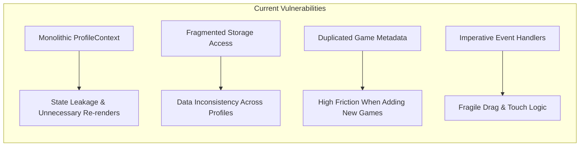

# 🔍 Chapter 2: Critical Audit of Current Architecture

## 2.1 Overview of Current System State

An in-depth audit of the repository reveals significant positive evolution alongside critical structural bottlenecks that threaten long-term maintainability.

### 🟢 Strengths Identified:
- **Feature-Based Screen Structure**: Screens under `src/app/screens/` are organized into feature subfolders (`home/`, `settings/`, `progress/`, `games-list/`).
- **Initial Platform Separation**: The creation of `src/app/game-platform/` provides a strong foundation for shared primitives, layouts, and storage helpers.
- **Decomposition of Screen Monoliths**: Recent refactoring successfully reduced monolithic files (`SceneBuilderScreen.tsx` down to 237 lines, `useSceneBuilderState.ts` to 230 lines, `useSceneBuilderHandlers.ts` to 48 lines).

---

## 2.2 Critical Vulnerabilities & Architectural Bottlenecks

Despite recent improvements, the application suffers from four architectural anti-patterns:

### 1. Monolithic State in `ProfileContext.tsx`
* **Finding**: `ProfileContext.tsx` manages profile selection, profile creation, settings updates, and progress reporting in a single React context.
* **Impact**: Every time progress is updated for an active game, the entire profile list array is modified, triggering global re-renders across the entire component tree, including static UI elements like header bars and navigation menus.
* **Risk**: High performance degradation on low-end tablets and mobile devices when frequent progress events fire during gameplay.

### 2. Dual Truth in Game Metadata (`data/games.ts` vs. `games/registry.ts`)
* **Finding**: Metadata such as game title, category, age range, and thumbnail URLs are duplicated across `src/app/data/games.ts`, `src/app/games/registry.ts`, and individual game configs.
* **Impact**: Adding a new mini-game requires editing 3–4 separate files across different directories.
* **Risk**: Inconsistencies between game catalog displays and actual game capabilities (e.g., speech recognition flags).

### 3. Mixed Storage Abstraction Layer
* **Finding**: Storage access is fragmented. `ProfileContext` calls `readStoredProfiles(profileStorage)`, while individual games directly call `localStorage.setItem(...)` or custom helper files for settings and unlocked rewards.
* **Impact**: Lack of atomic transactions and no central encryption/fallback strategy for storage quota errors on Safari/iOS.
* **Risk**: Potential data loss or profile corruption if local storage is cleared or restricted by privacy modes.

### 4. Over-Coupled Custom Hooks
* **Finding**: While large components have been decomposed, some state hooks initially aggregated too many responsibilities into single files (e.g., point dragging, panel docking, audio playback, speech parsing).
* **Impact**: Hard to write unit tests for specific behaviors (e.g., verifying polygon point calculations without rendering speech recognition refs).
* **Fix Applied**: Recently decomposed into `useZoneDevToolsDocking`, `useZoneDevToolsPoints`, `useScenePlacementHandlers`, `useSceneHintHandlers`, etc.

---

## 2.3 Architectural Debt Summary Table

| Category | Current State | Architectural Risk | Proposed Solution |
| :--- | :--- | :--- | :--- |
| **State Management** | Monolithic `ProfileContext` | Global tree re-renders on game ticks | Multi-store architecture (Profile, Settings, Analytics) |
| **Game Registry** | Hardcoded imports & duplicated metadata | High maintenance overhead per new game | Dynamic, type-safe `IGamePlugin` registry with lazy loading |
| **Storage Layer** | Fragmented `localStorage` calls | Quota errors, data corruption | Unified `IStorageAdapter` with fallback strategies |
| **Analytics & Progress** | Direct progress object mutation | Loss of practice history, inflexible reporting | Event-driven `PracticeEvent` pipeline |
| **Accessibility** | Variable touch target sizes | Frustration for young children | Standardized 48px UI primitives in `game-platform` |
