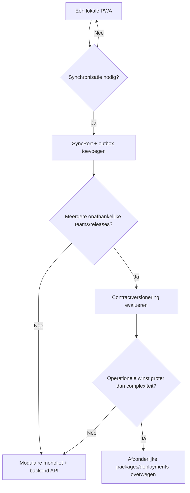

# 3. Architectuurprincipes en afwegingen

## 3.1 Principes

### 1. Correctheid vóór uitbreidbaarheid

Een nieuwe extensie-interface heeft pas waarde als typecheck, tests en build dezelfde contracten bewaken. Daarom is “groen op `npm run check`” de ingangseis voor verdere architectuurmigratie.

### 2. Organiseer op veranderreden

Profielen veranderen om andere redenen dan speech, media of spelregels. Code staat bij de feature of game die eigenaar is. Technische submappen (`ui`, `application`, `domain`, `infrastructure`) worden alleen binnen een module gebruikt wanneer ze de grens verduidelijken.

### 3. Afhankelijkheden wijzen naar contracten

Een game kent geen `ProfileContext`, router, Dexie, Sentry of `localStorage`. `GameHost` levert een smal runtimecontract. Browserimplementaties voldoen aan poorten die door de toepassing worden gedefinieerd.

### 4. State heeft één eigenaar en een benoemde levensduur

| State | Eigenaar | Levensduur | Voorbeeld |
| --- | --- | --- | --- |
| Renderstate | component | één renderboom | open dialoog |
| Gamesessiestate | gamecontroller/reducer | één sessie | huidige opdracht, geplaatste objecten |
| Shellstate | featureprovider | huidige app-run | actief profiel-id, bootstatus |
| Duurzame data | repository | over app-runs heen | profiel, oefenevent |
| HTTP-assets | service worker/Cache Storage | versie- en quotabeleid | video, audio, chunks |

Dupliceren is alleen toegestaan als één kopie expliciet een afgeleide cache/projectie is en opnieuw kan worden opgebouwd.

### 5. Observeer feiten, leid conclusies af

Games rapporteren feiten zoals antwoord, pogingen, tijd en gebruikte hulp. “Beheerst” is een versieerbare pedagogische afleiding en hoort niet als onomkeerbaar feit in het game-event.

### 6. Offline is een producttoestand

“Service worker geregistreerd” betekent niet “game offline beschikbaar”. De UI toont per wereld of alle vereiste code en media lokaal staan, hoeveel opslag nodig is en of een download is voltooid.

### 7. Privacy by design

Spraakinhoud, audio-opnames en vrije tekst van kinderen worden niet opgeslagen. Diagnostiek bevat standaard geen naam, transcript of ruwe interactie-inhoud. Verwijderen is volledig en testbaar.

### 8. Meten vóór optimaliseren

Bundlegrootte, starttijd, renderfrequentie en opslaggebruik worden gemeten. Een library of extra store wordt alleen toegevoegd voor een gemeten probleem of duidelijke complexiteitsreductie.

## 3.2 Belangrijkste afwegingen

### Modulaire monoliet versus microfrontends

**Keuze: modulaire monoliet.** Alle games delen dezelfde release, designbasis en lokale data. Microfrontends voegen versie-, runtime-, security- en deploymentcoördinatie toe zonder huidige organisatorische noodzaak. Interne grenzen worden met TypeScript, exports en dependencyregels afgedwongen.

Herbeoordelen wanneer games door onafhankelijke teams met eigen releasecycli worden beheerd en de gedeelde runtime stabiel genoeg is om extern te versioneren.

### Compile-time registry versus runtime plugins

**Keuze: expliciete compile-time registry met dynamische imports.** Dit ondersteunt tree splitting, review, contracttests en offline manifests. Automatisch alle mappen globben bespaart één registryregel maar verbergt productselectie en kan onbedoelde code bundelen.

### React Context versus globale storelibrary

**Keuze: geen nieuwe storelibrary in de basisarchitectuur.** Gamesessiestate blijft lokaal in reducers/controllers. Laagfrequente shellstate kan in kleine contexts. Duurzame events zitten niet in React-state maar in repositories met queryhooks.

Een selector-gebaseerde store kan later worden gekozen als profiling aantoont dat contextupdates een echt renderprobleem veroorzaken. Dan wordt de keuze met benchmark en ADR vastgelegd.

### IndexedDB versus `localStorage`

**Keuze: IndexedDB voor gestructureerde domeindata; `localStorage` alleen voor kleine, niet-kritieke bootvoorkeuren.** IndexedDB ondersteunt grotere datasets, indexen en transacties. Dexie is de voorgestelde dunne wrapper vanwege schema- en migratieondersteuning. Alle toegang blijft achter repositories zodat de library vervangbaar en testbaar is.

### Append-only events versus alleen totalen

**Keuze: append-only oefenobservaties plus afgeleide projecties.** Alleen totalen verliezen uitleg en verhinderen herberekening. Volledige event sourcing voor alle appdata is onnodig. Daarom zijn alleen leermomenten events; profiel en settings zijn records.

### Handgeschreven service worker versus Workbox

**Keuze: build-gegenereerde precache en expliciete runtimecaches via Workbox.** De huidige handmatige lijst en cacheversie kunnen afwijken van gehashte build-output. Game-media wordt niet blind geprecachet, maar per offlinepakket beheerd.

### Eén UI-library

**Keuze: Tailwind plus bestaande Radix-gebaseerde primitives als basis; MUI en ongebruikte widgetlibraries verwijderen na Knip- en importcontrole.** Twee designsystemen vergroten styling- en bundelcomplexiteit. Uitzonderingen vereisen een concreet ontbrekend component en een bundle-impactcheck.

## 3.3 Beslisregel voor nieuwe abstracties

Een gedeelde abstractie wordt pas toegevoegd wanneer ten minste één van deze condities geldt:

- zij beschermt een externe grens zoals opslag, browser-API of observability;
- zij verwijdert aantoonbare duplicatie uit minimaal twee echte consumers;
- zij legt een productbreed contract vast, zoals oefenobservaties;
- zij maakt een kritieke flow onafhankelijk testbaar.

“Misschien later nuttig” is onvoldoende.

## 3.4 Evolutiepad

De doelarchitectuur voorkomt een latere backend niet; zij stelt die investering uit tot er een sync-, beheer- of samenwerkingsrequirement bestaat.
