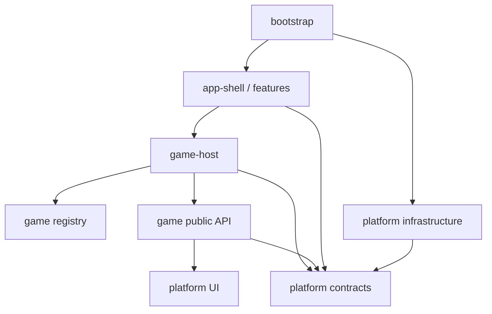

# 4. Doelarchitectuur en modulegrenzen

## 4.1 Logische opbouw

```txt
src/
  bootstrap/                 # createRoot, globale error handlers, SW-registratie
  app/
    routes/                  # routes en route-level lazy loading
    shell/                   # globale layout, guards, providers
    features/
      profiles/
      catalog/
      settings/
      progress/
    game-host/               # resolve, laden, boundary, runtime samenstellen
  games/
    registry.ts              # lichte manifesten + dynamische loaders
    strand-bezem-escape/
      manifest.ts            # geen zware assets/imports
      index.ts               # publieke exports
      domain/                # pure spelregels en types
      application/           # controller/reducer/use-cases
      ui/                    # schermen en gamecomponenten
      content/               # opdrachten en pedagogische metadata
      assets/                # manifest met URL/bytes/hash, geen globaal barrel
  platform/
    contracts/               # runtime-, storage-, media-, speech- en eventpoorten
    storage/                 # Dexie + migraties + repositories
    media/                   # audio/video en offlinepakketbeheer
    speech/                  # browserdetectie, toestemming en adapter
    observability/           # logger, foutreporter, diagnose-export
    pwa/                     # SW-update- en cachestatus
    ui/                      # productbrede gameprimitives/layouts
  shared/
    types/                   # echt domein-neutrale types
    utils/                   # kleine pure helpers met meerdere consumers
```

Dit is een doelbeeld, geen verzoek om alles in één big-bang te verplaatsen. De bestaande `src/app/game-platform` kan eerst de rol van `platform` blijven vervullen. Hernoemen gebeurt alleen wanneer imports al stabiel zijn.

## 4.2 Modulelagen

Binnen een feature of complexe game gebruiken we maximaal vier rollen:

| Rol | Verantwoordelijkheid | Mag afhankelijk zijn van |
| --- | --- | --- |
| `domain` | Pure regels, waardetypes en invarianten | Alleen eigen domain en smalle shared types |
| `application` | Use-cases, reducer/controller, poorten aanroepen | Eigen domain en platformcontracten |
| `ui` | React-weergave en interactie | Eigen application/domain en platform-UI |
| `infrastructure` | Implementatie van browser- of leveranciersgrens | Contract dat wordt geïmplementeerd |

Niet iedere map heeft alle vier nodig. Een klein scherm met alleen presentatie blijft één co-located component.

## 4.3 Toegestane afhankelijkheidsrichting



Harde verboden:

- `platform` importeert geen concrete game of app-feature;
- een game importeert geen andere game;
- een game importeert geen route, globale context, Dexie-database of leveranciers-SDK;
- `domain` importeert geen React of browser-API;
- features lezen geen interne bestanden van een andere feature; alleen diens publieke `index.ts`;
- barrelbestanden mogen geen zware assets of ongebruikte implementaties eager importeren.

Deze regels worden met Dependency Cruiser en ESLint `no-restricted-imports` in CI afgedwongen.

## 4.4 App-shell

De shell doet uitsluitend:

- storage bootstrappen en migratiestatus tonen;
- actief profiel selecteren;
- routes en guards beheren;
- catalogus tonen;
- `GameHost` starten met `themeId` en `gameId`;
- globale fout-, update- en offline-status tonen.

De shell kent geen opdracht, wereld, scoreformule of gameasset.

Routes worden per feature lazy geladen. De game-route laadt eerst alleen `GameHost` en de lichte registry. Pas na resolve en capabilitychecks wordt de gamechunk geladen.

## 4.5 Featuremodules

Iedere feature exporteert een kleine publieke API. Voorbeeld:

```txt
features/profiles/
  domain/profile.ts
  application/profileService.ts
  ui/ProfileSelectScreen.tsx
  profile.routes.ts
  index.ts
```

`profiles/index.ts` exporteert bijvoorbeeld `ProfileSelectRoute`, `useActiveProfile` en `ProfileReader`; niet de database-implementatie of interne componenten.

## 4.6 Platform is geen verzamelbak

Een component of helper verhuist pas naar `platform` wanneer twee echte modules hetzelfde gedrag nodig hebben en de semantiek gelijk is. Tot die tijd blijft het co-located. Platformcode heeft een eigenaar, contracttests en een changelog/ADR wanneer een contract breekt.

## 4.7 Fout- en laadgrenzen

Er zijn drie afzonderlijke boundaries:

1. **Route boundary** — onverwachte fout in een globaal scherm; biedt terug naar home en diagnose-id.
2. **Game load boundary** — chunk/manifest/capability kan niet laden; biedt retry, update en terug naar catalogus.
3. **Game runtime boundary** — render- of runtimefout binnen een game; beëindigt sessie gecontroleerd en laat shell werken.

Lazy loading zonder deze boundaries geldt niet als isolatie.

## 4.8 Publieke contractversies

Interne TypeScript-interfaces hoeven niet allemaal een versieveld. Persistente payloads en grensberichten wel:

- `PracticeEvent.schemaVersion`;
- `GameManifest.contractVersion`;
- databaseversie en expliciete migraties;
- diagnose-exportversie.

Breaking changes worden bij voorkeur via een nieuwe parser/migratie ondersteund voordat oude data wordt verwijderd.

## 4.9 Geen verplichte bestandsvorm

De architectuur schrijft verantwoordelijkheden en imports voor, niet overal dezelfde mapdiepte. Een bestand wordt gesplitst wanneer:

- het meerdere veranderredenen heeft;
- pure logica niet zonder React te testen is;
- een deel een eigen lifecycle of foutbeleid heeft;
- review en navigatie aantoonbaar moeilijk worden.

Regelaantal is een signaal in review, geen harde systeemregel.
