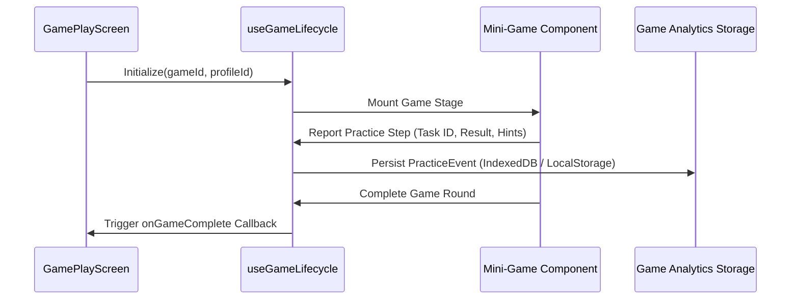

# 🕹️ Chapter 4: Game Engine & Plugin System

## 4.1 The `IGamePlugin` Interface Contract

To enable seamless plug-and-play integration of dozens of educational mini-games, every game package must export a standardized plugin contract (`IGamePlugin`).

```ts
// src/app/game-platform/types/game-plugin.ts

import type { ComponentType } from "react";
import type { GameConfig } from "./game-config";

export interface GameLaunchProps {
  profileId: string;
  onBackToMenu: () => void;
  onGameComplete?: (summary: GameCompletionSummary) => void;
}

export interface GameCompletionSummary {
  gameId: string;
  totalStarsEarned: number;
  totalSpeedEarned: number;
  practicedConcepts: string[];
  durationSeconds: number;
}

export interface IGamePlugin {
  config: GameConfig;
  Component: ComponentType<GameLaunchProps>;
  preloadAssets?: () => Promise<void>;
}
```

---

## 4.2 Dynamic Game Registry & Lazy Loading

Instead of statically importing every game into the application bundle, games are registered in a centralized, lazy-loaded registry (`gameRegistry`).

```ts
// src/app/games/registry.ts

import { lazy } from "react";
import type { IGamePlugin } from "../game-platform/types/game-plugin";
import { gameConfig as bezemEscapeConfig } from "./strand-bezem-escape/game.config";

export const gameRegistry: Record<string, { config: typeof bezemEscapeConfig; load: () => Promise<IGamePlugin> }> = {
  "strand-bezem-escape": {
    config: bezemEscapeConfig,
    load: async () => {
      const module = await import("./strand-bezem-escape");
      return module.default;
    },
  },
};

export const getGameConfig = (gameId: string) => gameRegistry[gameId]?.config;
```

### Architectural Benefits:
1. **Zero Bundle Bloat**: A player launching "Strand Bezem Escape" will not download assets or code for "Reken Eiland" or "Vormen Bos".
2. **Instant App Startup**: The core App Shell loads in milliseconds because game code is code-split automatically via Vite dynamic imports.
3. **Isolated Failures**: A crash or missing asset in one game plugin does not break the rest of the application shell.

---

## 4.3 Unified Game Lifecycle Hook (`useGameLifecycle`)

To eliminate boilerplate across mini-games, the platform provides a `useGameLifecycle` hook that handles session initialization, audio preloading, activity timers, and progress event emission.


