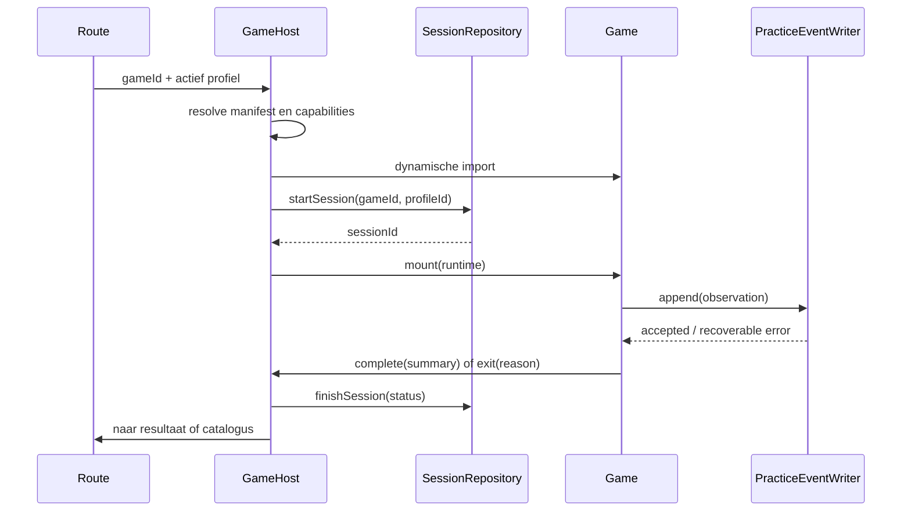

# 5. Gamemodulecontract en lifecycle

## 5.1 Geen generieke engine, wel een stabiele host

De huidige games verschillen waarschijnlijk sterk in interactie: slepen, kiezen, vliegen, spreken en later rekenen. Eén “engine” zou te vroeg details abstraheren. Wat wel productbreed stabiel is, is het starten, stoppen, meten, opslaan, herstellen en foutafhandelen van een gamesessie. Daarom standaardiseren we de **host-lifecycle**, niet de spelmechaniek.

## 5.2 Eén bron van waarheid

Elke game heeft één licht manifest. De catalogus en loader lezen daaruit. Alias-id's zoals de huidige varianten in `registry.ts` zijn niet toegestaan; een oude URL wordt via een expliciete redirectmigratie afgehandeld.

```ts
export type GameManifest = {
  contractVersion: 1;
  id: GameId;
  themeId: ThemeId;
  title: string;
  description: string;
  ageRange: { min: number; max: number };
  capabilities: Array<"audio" | "microphone" | "offline-package">;
  supportedOrientations: Array<"portrait" | "landscape">;
  releaseStatus: "available" | "beta" | "coming-soon";
  offlinePackages: OfflinePackageDescriptor[];
};

export type GameRegistryEntry = {
  manifest: GameManifest;
  load: () => Promise<GameModule>;
};
```

`manifest.ts` importeert geen componenten, contentbestanden of media. De registry gebruikt een statische dynamische import, zodat de bundler een afzonderlijke chunk maakt:

```ts
export const gameRegistry = {
  "strand-bezem-escape": {
    manifest: strandBezemEscapeManifest,
    load: () => import("./strand-bezem-escape"),
  },
} satisfies Record<GameId, GameRegistryEntry>;
```

## 5.3 Runtimecontract

De host construeert afhankelijkheden en geeft ze aan de game. De game mag geen globale provider zelf ophalen.

```ts
export type GameRuntime = {
  identity: {
    gameId: GameId;
    profileId: ProfileId;
    sessionId: SessionId;
  };
  clock: Clock;
  ids: IdGenerator;
  practice: PracticeEventWriter;
  media: MediaController;
  speech: SpeechController;
  diagnostics: DiagnosticLogger;
  lifecycle: {
    exit: (reason: GameExitReason) => void;
    complete: (summary: GameSessionSummary) => void;
  };
};

export type GameModule = {
  Game: React.ComponentType<{ runtime: GameRuntime }>;
};
```

De runtime bevat capabilities, geen database- of SDK-objecten. Daardoor kan een test fake clock, ids, speech en eventwriter leveren.

## 5.4 Lifecycle



Sessiestatus is `started | completed | abandoned | crashed`. De host sluit een open sessie bij route-exit, visibility timeout of runtimefout. Eventwrites zijn idempotent op `eventId`.

## 5.5 Game-interne opbouw

Een complexe game gebruikt:

- pure domainfuncties voor parsing, plaatsing, score en validatie;
- een expliciete reducer/state machine voor scherm- en rondestatus;
- application-effects voor media, speech en persistence;
- UI-componenten die een viewmodel tonen en acties dispatchen.

Een state-machine-library is niet standaard nodig. Gebruik een gediscrimineerde union en reducer. Evalueer XState pas wanneer parallelle states, hervatting en transities aantoonbaar onoverzichtelijk worden.

```ts
type GameState =
  | { status: "selecting-world"; selectedWorldId: WorldId }
  | { status: "playing"; round: RoundState }
  | { status: "reward"; summary: RoundSummary }
  | { status: "blocked"; reason: CapabilityFailure };
```

Hiermee worden ongeldige combinaties — bijvoorbeeld reward zonder summary — type-technisch onmogelijk.

## 5.6 Contracttests voor iedere game

Een gedeelde test-suite controleert:

- manifest voldoet aan runtime-schema en id komt exact overeen met registry-key;
- loader resolveert en exporteert `Game`;
- mount met fake runtime doet geen globale opslag- of netwerkcall;
- exit en complete sluiten maximaal één keer af;
- capability ontbreekt geeft bruikbare fallback;
- game veroorzaakt geen import naar app-shell of infrastructuur;
- vereiste offline-assets staan in het manifest en bestaan na build.

## 5.7 Assets en content

- Content heeft stabiele ids die niet uit arraypositie komen.
- Content wordt bij build/test met een schema gevalideerd.
- Media-assets hebben type, bytegrootte, hash en pedagogische functie in een gegenereerd manifest.
- Een game importeert alleen assets van de actieve wereld/modus waar technisch mogelijk.
- Content en assets zijn versieerbaar, zodat events blijven verwijzen naar de opdrachtversie die het kind zag.

## 5.8 Nieuwe game toevoegen

De definitie van “eenvoudig toevoegen” is niet “een map droppen in 30 minuten”. Een game is klaar wanneer:

1. manifest en registry-entry bestaan;
2. contracttests slagen;
3. minimaal één happy path en één herstelpad als Playwright-test bestaan;
4. oefenevents schema-geldig zijn;
5. accessibility- en performancebudgetten slagen;
6. offlinegedrag expliciet is gekozen en getest;
7. leerdoel en dataminimalisatie zijn vastgelegd.

Dit kost meer dan één registryregel, maar voorkomt dat snelheid wordt gekocht met verborgen integratieschuld.
