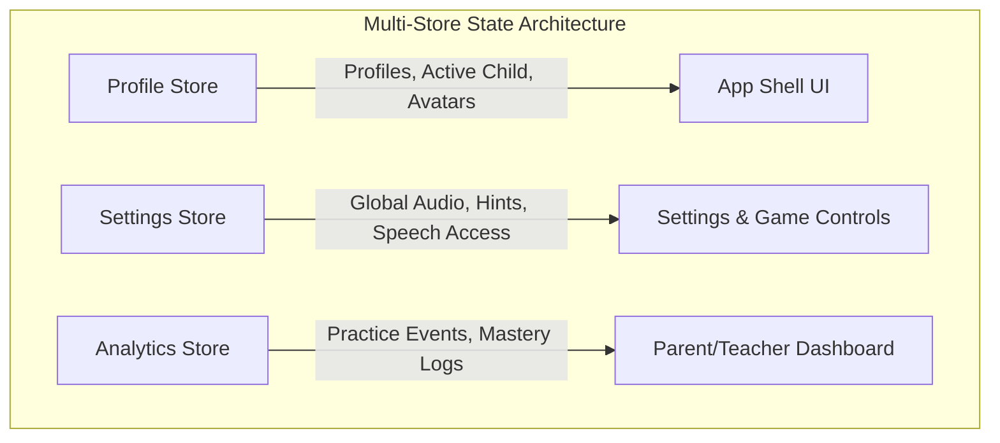

# 💾 Chapter 5: State Management, Storage & Analytics

## 5.1 Redesigned State Management Architecture

To solve the global re-render performance issues caused by the current monolithic `ProfileContext`, we propose splitting application state into three lightweight, domain-focused reactive stores.



### 1. `ProfileStore`
* **Scope**: Profile creation, switching active profile, avatar selection.
* **Update Frequency**: Low (only when user explicitly switches child profile).
* **Isolation**: Changing active profile does not trigger re-renders in analytics calculators.

### 2. `SettingsStore`
* **Scope**: Sound volume, background music toggle, progressive hint enablement, voice control toggles.
* **Update Frequency**: Low.

### 3. `AnalyticsStore`
* **Scope**: In-memory practice event buffer, recent skill achievements, daily streak logs.
* **Update Frequency**: High (emits events per completed task during gameplay).
* **Isolation**: Flushes events asynchronously to local storage without blocking UI thread.

---

## 5.2 Storage Layer & `IStorageAdapter`

All persistent data operations must go through a unified storage interface (`IStorageAdapter`).

```ts
// src/app/game-platform/storage/storage.types.ts

export interface IStorageAdapter {
  getItem<T>(key: string): Promise<T | null>;
  setItem<T>(key: string, value: T): Promise<void>;
  removeItem(key: string): Promise<void>;
  clear(): Promise<void>;
}
```

### Storage Backends & Fallback Hierarchy:
1. **Primary Backend**: `LocalStorageAdapter` for high-speed synchronous profile and settings retrieval.
2. **Analytics & Asset Backend**: `IndexedDBAdapter` for storing high-volume `PracticeEvent` history and caching offline audio/video manifests.
3. **Fallback Backend**: In-Memory Storage Adapter if private browsing mode or storage quotas block persistent storage access.

---

## 5.3 Event-Driven Educational Analytics Engine

Games report practice data via a standardized, immutable `PracticeEvent` payload:

```ts
// src/app/game-platform/progress/progress.types.ts

export interface PracticeEvent {
  id: string;
  profileId: string;
  gameId: string;
  instructionId: string;
  timestamp: string;

  // Pedagogical domain metadata
  languageDomains?: string[];
  spatialConcepts?: string[];
  targetWords?: string[];

  // Performance metrics
  isCorrect: boolean;
  result: "mastered" | "supported" | "needs-practice";
  assistance: "none" | "audio-repeat" | "hint" | "spoken-help";
  attempts: number;
  hintsUsed: number;
  audioRepeats: number;
  speedEarned: number;
  wordStarsEarned: number;
}
```

### Analytics Calculation Strategy:
Parent/teacher dashboards derive skill mastery dynamically from recent `PracticeEvent` records:
- **Mastered (Groen)**: Completed independently with `assistance: "none"` on first attempt.
- **In Progress (Geel)**: Completed with `assistance: "audio-repeat"` or 1 hint.
- **Needs Practice (Oranje)**: Required multiple hints or spoken help.

This ensures dashboards reflect actual learning progression accurately across all mini-games.
