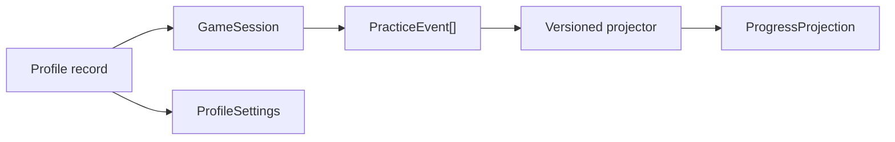

# 6. Data, state, opslag, analytics en privacy

## 6.1 Hoofdmodel

De architectuur maakt onderscheid tussen records, sessies, observaties en projecties:



- **Record:** actuele waarheid die wordt bijgewerkt, zoals profiel en settings.
- **Sessie:** begrensde game-run met start/eind/status.
- **Observatie-event:** onveranderlijk feit over één oefenpoging.
- **Projectie:** herbouwbare samenvatting voor snelle dashboardqueries.

## 6.2 Opslagkeuze

Gebruik IndexedDB via Dexie voor gestructureerde, duurzame data. Dexie blijft achter repositories; UI en games importeren de library niet rechtstreeks.

Voorgestelde tabellen:

```txt
profiles              id, createdAt, updatedAt
profileSettings       profileId
gameSessions          id, profileId, gameId, startedAt, endedAt, status
practiceEvents        id, profileId, gameId, sessionId, taskId, occurredAt
progressProjections   [profileId+skillId], projectorVersion, calculatedAt
databaseMeta          key, value
```

`localStorage` blijft alleen toegestaan voor een kleine pre-bootvoorkeur, bijvoorbeeld globale mute of laatste database-openstatus. Kritieke voortgang staat er niet. Media en chunks staan in Cache Storage, niet als blobs in IndexedDB.

## 6.3 Repositorycontracten

```ts
export interface ProfileRepository {
  list(): Promise<Profile[]>;
  get(id: ProfileId): Promise<Profile | null>;
  create(input: CreateProfileInput): Promise<Profile>;
  update(id: ProfileId, patch: ProfilePatch): Promise<Profile>;
  deleteCascade(id: ProfileId): Promise<void>;
}

export interface PracticeRepository {
  append(event: PracticeEvent): Promise<AppendResult>;
  listForSession(sessionId: SessionId): Promise<PracticeEvent[]>;
  listForProjection(query: ProjectionQuery): Promise<PracticeEvent[]>;
}
```

Repositories vertalen technische fouten naar benoemde application-errors: `storage-unavailable`, `quota-exceeded`, `migration-failed`, `invalid-persisted-data`. Een stille in-memory fallback is verboden. Een tijdelijke modus mag alleen met een zichtbare melding dat voortgang niet wordt bewaard.

## 6.4 Schema's en migraties

- Iedere persistente grens heeft runtimevalidatie, bijvoorbeeld met Zod.
- Database-upgrades zijn oplopende, geteste Dexie-migraties.
- Migraties zijn idempotent waar mogelijk en draaien vóór routes die data nodig hebben.
- Onbekende velden mogen tijdens een compatibiliteitsperiode behouden blijven.
- Bij onherstelbare data wordt geen lege database overschreven; bied export, reset en diagnose-id.
- Fixturetests voeren iedere ondersteunde oude databaseversie door alle migraties.

## 6.5 Oefenevent

Games melden neutrale observaties. Een minimaal contract:

```ts
export type PracticeEventV1 = {
  schemaVersion: 1;
  id: EventId;
  occurredAt: string;
  profileId: ProfileId;
  sessionId: SessionId;
  gameId: GameId;
  contentVersion: string;
  taskId: TaskId;
  skillIds: SkillId[];
  outcome: "correct" | "incorrect" | "skipped";
  attemptNumber: number;
  responseTimeMs?: number;
  assistance: Array<"instruction-replay" | "visual-hint" | "spoken-help">;
};
```

Niet in dit event:

- naam of avatar van het kind;
- ruwe microfoonaudio of transcript;
- door de game berekende labels als `mastered`;
- willekeurige game-specifieke objecten zonder versieerbaar schema.

Game-specifieke details kunnen in een apart, schema-gevalideerd `details`-veld met een expliciet subtype, maar alleen wanneer ze nodig zijn voor een vastgesteld leer- of debugdoel.

## 6.6 Projecties en mastery

Een projector vertaalt events naar dashboardwaarden. De projector heeft een versie en tests met pedagogisch vastgelegde voorbeelden. Bij een formulewijziging worden projecties opnieuw opgebouwd; events blijven intact.

```ts
type ProgressProjection = {
  profileId: ProfileId;
  skillId: SkillId;
  projectorVersion: number;
  independentCorrect: number;
  supportedCorrect: number;
  attempts: number;
  lastPracticedAt: string;
  status: "not-started" | "practicing" | "confident";
};
```

Een status is een productinterpretatie, geen diagnostische uitspraak over het kind. De UI legt in eenvoudige taal uit waarop zij is gebaseerd.

## 6.7 Transactionele schrijfroute

Per poging:

1. game maakt een event met door de runtime geleverd id en tijd;
2. repository valideert het schema;
3. event wordt idempotent toegevoegd;
4. relevante projectie wordt in dezelfde IndexedDB-transactie bijgewerkt of als “dirty” gemarkeerd;
5. game krijgt `accepted`, `duplicate` of een herstelbare fout.

Een UI-frame wacht niet op een volledige dashboardherberekening. Bij write-falen houdt een beperkte retryqueue events in geheugen zolang de sessie open is; de UI meldt wanneer duurzame opslag niet lukt.

## 6.8 React-state

- Actief profiel-id: kleine shellcontext.
- Profielenlijst en projecties: repositoryqueries met expliciete loading/error/empty states.
- Gameflow: lokale reducer/controller.
- Audio/speechstatus: capability-adapter en lokaal abonnement.
- Geen complete eventbuffer in een globale React-store.

Als live IndexedDB-queries nodig zijn, kan `dexie-react-hooks` achter featurehooks worden gebruikt. Componenten krijgen geen `db`-object.

## 6.9 Privacy en bewaarbeleid

Omdat de app gegevens van jonge kinderen verwerkt, gelden minimaal:

- dataminimalisatie en doelbinding per veld;
- geen cloudtelemetrie zonder expliciete product-, juridische en ouderlijke beslissing;
- geen speechtranscripten of audio-opnames bewaren;
- profiel verwijderen is een transactionele cascade delete;
- diagnose-export vervangt profiel-id door een tijdelijke lokale alias;
- bewaartermijn voor ruwe oefenevents is configureerbaar; oudere events kunnen na goedgekeurde projectie worden gecompacteerd of verwijderd;
- export en reset zijn toegankelijk vanuit een volwassen/begeleidersscherm;
- analytics voor productgebruik en leerprogressie zijn aparte datadoelen en datasets.

## 6.10 Toekomstige synchronisatie

Een backend wordt pas toegevoegd na een expliciet syncbesluit. Repositories maken dat mogelijk via een latere `SyncPort` en outbox. Vereisten vóór sync:

- authenticatie en ouder-/schoolbeheer;
- conflictstrategie per recordtype;
- encryptie tijdens transport en opslag;
- server-side autorisatie en audit;
- verwijderverzoeken over alle replica's;
- DPIA en bewaarbeleid.

De lokale architectuur mag nooit aannemen dat “offline-first” automatisch “later probleemloos syncbaar” betekent.
