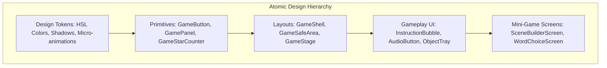

# 🎨 Chapter 6: Design System, UI/UX & Accessibility

## 6.1 Game Wereld Design System Architecture

To ensure a visual experience that wows young learners while maintaining consistency across mini-games, the application relies on an **Atomic Design System** housed in `src/app/game-platform/components/`.

---

## 6.2 Key Design Principles for Children (Ages 4–8)

1. **Rich & Vibrant Aesthetic**:
   Avoid generic plain colors. Use curated HSL color palettes, warm playful gradients (`from-amber-400 to-amber-500`), tactile drop shadows (`shadow-[0_4px_0_rgba(15,23,42,0.18)]`), and glassmorphism backdrop blurs (`backdrop-blur-md`).

2. **Tactile Micro-Animations**:
   Buttons press down on active touch states (`active:translate-y-1`), rewards pop up with scale springs, and audio visualizers animate smoothly to create physical feedback.

3. **Zero Text-Heavy Obstacles**:
   Pre-literate children must be able to navigate without reading. Every action button includes an iconic visual symbol alongside voice prompts.

---

## 6.3 Child Accessibility Standards (WCAG & Touch Guidelines)

| Requirement | Standard | Implementation Rule |
| :--- | :--- | :--- |
| **Touch Target Area** | Min 48x48px (Recommended 56x56px) | All interactive buttons must enforce `min-h-12 min-w-12` or `min-h-14`. |
| **Touch Spacing** | Min 12px gap between controls | Grid and tray layouts enforce `gap-3` or `gap-4` to prevent accidental mis-taps. |
| **Visual Contrast** | WCAG AA compliant (4.5:1 ratio) | Text labels use dark slate (`text-slate-950`) over bright opaque backgrounds. |
| **Audio-First Feedback** | Voice prompts for non-readers | Tapping any card or object icon plays a speech synthesis or audio prompt. |
| **No Accidental Drag Slips** | 8px drag threshold | Drag gestures trigger only after moving > 8px to prevent tap-vs-drag confusion. |
| **Orientation Safety** | Landscape & Portrait Safe Areas | Utilizes `calc(env(safe-area-inset-*))` padding to protect against mobile camera notches. |
