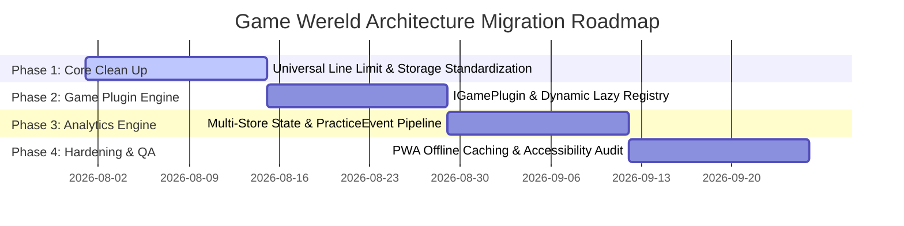

# 🗺️ Chapter 7: Migration Strategy & Roadmap

## 7.1 Phased Migration Roadmap

To transition the existing codebase to the target architecture without breaking existing gameplay or interrupting development, we propose a four-phase incremental migration plan.

---

## 7.2 Detailed Execution Phases

### Phase 1: Universal Modular Codebase Enforcement & Storage Standardization
- Enforce the **Universal 250 Lines Rule** across all component files (`.tsx`), custom state hooks (`.ts`), and logic helpers (`.ts`).
- Replace fragmented `localStorage` calls with the unified `BrowserGameStorage` adapter in `src/app/game-platform/storage/`.
- Ensure all screens use standardized primitives (`GameButton`, `GamePanel`, `GameShell`).

### Phase 2: `IGamePlugin` Engine & Dynamic Game Registry
- Formalize the `IGamePlugin` contract in `src/app/game-platform/types/game-plugin.ts`.
- Implement dynamic lazy loading in `src/app/games/registry.ts` using Vite dynamic imports (`import()`).
- Update `GamePlayScreen.tsx` to dynamically mount game plugins based on the active route parameter (`:gameId`).

### Phase 3: Multi-Store State Management & Practice Analytics Engine
- Decouple `ProfileContext.tsx` into three independent stores: `ProfileStore`, `SettingsStore`, and `AnalyticsStore`.
- Implement the immutable `PracticeEvent` pipeline to record practice session milestones without mutating global profile state.
- Wire the parent/teacher progress dashboard to compute analytics dynamically from practice event logs.

### Phase 4: PWA Offline Caching, Asset Preloading & Accessibility Audit
- Configure asset manifests and ServiceWorker preloader for offline play in classroom environments.
- Verify 48px touch targets, audio prompts, and high-contrast color accessibility across portrait and landscape viewports.
- Run automated type checks (`npm run build`) and cross-browser testing.

---

## 7.3 Risk Assessment & Mitigation Matrix

| Potential Risk | Severity | Probability | Mitigation Strategy |
| :--- | :--- | :--- | :--- |
| **Breaking existing mini-game state** | High | Low | Conduct incremental refactoring per game subfolder; run automated TypeScript checks (`npm run build`) after every file edit. |
| **Storage quota limits on mobile iOS Safari** | Medium | Medium | Implement fallback memory adapter and compress `PracticeEvent` payloads in IndexedDB. |
| **Speech recognition latency/unavailability** | Low | High | Fall back gracefully to manual visual object tap/click interfaces when speech API is unavailable. |

---

## 7.4 Architectural Conclusion

By adopting this proposal, **Game Wereld** gains an enterprise-grade, extensible software architecture. Mini-games become modular plugins, state management is decoupled and lightweight, performance is optimized through lazy loading, and analytics accurately capture every step of a child's learning journey.
