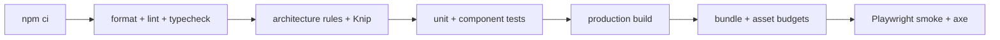

# 8. Code Quality & Architecture Requirements

Dit hoofdstuk is normatief. Het vervangt de huidige projectregels voor onder andere universele bestandslengte, verplichte arrow functions en `displayName`. Kwaliteit wordt beoordeeld op correctheid, begrijpelijkheid, testbaarheid en afgedwongen grenzen — niet op één vormregel.

## 8.1 Definitie van klaar

Een wijziging is niet klaar voordat:

```sh
npm run format:check
npm run lint
npm run typecheck
npm run test
npm run test:architecture
npm run build
```

succesvol zijn. `npm run check` voert de eerste vijf uit; CI voert daarna build en relevante end-to-endtests uit. Vite-build is expliciet geen typecheck.

## 8.2 TypeScript

- `strict` blijft aan.
- Productiecode bevat geen expliciete `any`, behalve in een lokaal geïsoleerde compatibiliteitsadapter met commentaar en test.
- Onbekende externe data start als `unknown` en wordt bij de grens gevalideerd.
- Publieke module-API's en persistente contracten hebben expliciete types.
- Gediscrimineerde unions modelleren toestanden die elkaar uitsluiten.
- Branded ids (`ProfileId`, `GameId`, `SessionId`) voorkomen verwisseling van gewone strings.
- `@ts-ignore` is verboden; `@ts-expect-error` mag alleen met reden en een test die de verwachting bewaakt.
- Type assertions (`as`) worden niet gebruikt om contractfouten weg te drukken.
- Exhaustieve switches eindigen in een `never`-check.
- `noUncheckedIndexedAccess` wordt na reparatie van de bestaande fouten gefaseerd aangezet.

## 8.3 Module- en afhankelijkheidsregels

- Iedere feature/game heeft één publieke entrypoint.
- Deep imports in een andere feature/game zijn verboden.
- `domain` importeert geen React, DOM, opslag of leverancierslibrary.
- Games importeren geen app-shell, route, globale context of infrastructuurimplementatie.
- Browserglobals (`window.localStorage`, `speechSynthesis`, `AudioContext`, `caches`) zijn alleen toegestaan in aangewezen adapters/bootstrap.
- Geen circulaire module- of featureafhankelijkheden.
- `shared` accepteert alleen code met minimaal twee bestaande consumers en domein-neutrale semantiek.
- Een nieuw extern package vereist motivatie, license/securitycheck, bundle-impact en verwijderplan als het experimenteel is.

Dependency Cruiser maakt deze regels blokkerend in CI. ESLint vangt lokale importverboden snel in de editor.

## 8.4 Functies, componenten en bestanden

- Eén module heeft één samenhangende veranderreden.
- Pure berekeningen blijven buiten render en effects.
- Components orchestreren alleen wanneer dat hun expliciete rol als container/route/gamehost is.
- Hooks verbergen geen duurzame writes of globale side effects achter een onduidelijke naam.
- Effects zijn voor synchronisatie met een extern systeem, niet voor afleidbare state.
- Props en hookreturns zijn taakgericht; geen grote “god objects” zonder grens.
- Function declarations en arrow functions zijn beide toegestaan; kies de vorm die hoisting, naamgeving en leesbaarheid ondersteunt.
- `displayName` is alleen verplicht voor wrappers waarbij DevTools anders een onbruikbare naam toont.
- `data-component`/`data-slot` zijn test- of diagnosecontracten, geen decoratieve verplichting.

Er is geen harde 250-regellimiet. Reviewers onderzoeken bestanden boven circa 300 regels of functies boven circa 50 regels op meerdere verantwoordelijkheden, maar coherente data/configuratie mag langer zijn.

## 8.5 Foutafhandeling

- Verwachte fouten zijn benoemde resultaten of application-errors; onverwachte fouten gaan naar een boundary.
- Lege catch-blokken zijn verboden.
- Een catch voegt context toe, herstelt aantoonbaar of geeft de fout door.
- Gebruikersmeldingen bevatten een actie: opnieuw proberen, opslag vrijmaken, alternatief gebruiken of veilig teruggaan.
- Logs bevatten eventnaam, severity, subsystem, release en correlation/session-id; geen persoonsgegevens of speechinhoud.
- Fouten uit storage, media, speech, lazy imports en service workers hebben tests voor minstens één herstelpad.

## 8.6 Data en side effects

- Persistente input wordt runtime gevalideerd.
- Geldbedragen zijn niet relevant, maar tijden wel: opgeslagen tijd is ISO UTC; duur gebruikt een monotone klok waar mogelijk.
- Ids komen van `crypto.randomUUID()` via een injecteerbare generator, niet van `Date.now()`.
- Randomisatie gebruikt een seed wanneer reproduceerbaarheid of analyse nodig is.
- Writes zijn idempotent of hebben een expliciete duplicate-strategie.
- Verwijderacties met brede impact vragen volwassen/begeleidersbevestiging en zijn transactioneel.
- Tests gebruiken in-memory/fake repositories; geen globale `localStorage` gedeeld tussen tests.

## 8.7 Testvereisten

### Pure domainlogica

- Alle score-, parsing-, plaatsings-, randomisatie- en projectieregels hebben unit tests.
- Randgevallen en invarianten zijn belangrijker dan snapshots.
- Kritieke domainmodules mikken op minimaal 90% branch coverage; afwijkingen worden gemotiveerd.

### React en integratie

- Test gedrag via rollen, namen en zichtbare feedback.
- Vermijd tests die Tailwindclasses of interne hookcalls vastleggen.
- Gebruik echte reducers/repositories met fake browseradapters waar haalbaar.
- Iedere persistente migratie heeft fixtures van oude versies en een mislukpad.

### End-to-end

Minimale blokkerende flows:

1. profiel aanmaken, app herladen en profiel terugvinden;
2. game starten, opdracht voltooien en voortgang zien;
3. microfoon weigeren en handmatig verder spelen;
4. offlinewereld downloaden, offline herladen en spelen;
5. storage-/mediafout herstellen zonder blanco scherm;
6. profiel verwijderen en cascade delete verifiëren;
7. service-workerupdate uitstellen tot veilige game-exit.

Playwright bewaart trace, console en screenshot bij falen. Flaky tests worden niet onbeperkt geretryd of stil overgeslagen; ze krijgen eigenaar en hersteltermijn.

## 8.8 Toegankelijkheid

- WCAG 2.2 AA is release-eis.
- Semantische HTML heeft voorkeur boven ARIA-reparaties.
- Interacties zijn niet uitsluitend afhankelijk van drag, hover, geluid, kleur of spraak.
- Kindgerichte controls zijn minimaal 48×48 CSS-pixels.
- Automatische axe-checks zijn verplicht voor kernschermen.
- Handmatige toetsenbord- en screenreadercheck staat op de releasechecklist.

## 8.9 Performance en assets

- Registry en routes gebruiken lazy boundaries; app-shell importeert geen game-implementatie.
- Een PR mag bundle- en offlinepakketbudgetten niet ongemotiveerd overschrijden.
- Ongebruikte exports, bestanden en dependencies worden periodiek met Knip verwijderd.
- Assets hebben bron, licentie, hash, bytegrootte en consumer.
- Geen eager preload van alle video/audio.
- Optimalisatie die leesbaarheid verlaagt vereist een gemeten winst.

## 8.10 Security en privacy

- Geen secrets in frontendcode of Vite client environment variables.
- Geen dynamische uitvoering van content (`eval`, onbeheerde HTML).
- URL's en content van externe bron worden gevalideerd en gesanitized.
- Dependencyupdates worden geautomatiseerd voorgesteld en in CI getest.
- Telemetrie is standaard privacyarm en uit voor inhoudelijke kinddata.
- Session replay, input capture en raw speech zijn verboden tenzij een afzonderlijke privacybeslissing dit expliciet toestaat; de standaardarchitectuur gaat ervan uit dat dit niet gebeurt.
- Securityheaders en CSP worden op hostingniveau getest.

## 8.11 Review- en documentatiebeleid

- Grote beslissingen krijgen een ADR met context, besluit, alternatieven en consequenties.
- Een architectuurdiagram beschrijft alleen bestaande of duidelijk als doel gemarkeerde onderdelen.
- TODO's hebben issue-id/eigenaar of worden niet gemerged.
- Een PR benoemt datamigratie, offline-impact, toegankelijkheid, privacy en rollback wanneer relevant.
- Documentatie en codevoorbeelden worden meegewijzigd met contracten.

## 8.12 Blokkerende CI-volgorde



Snelle statische checks draaien eerst. E2E mag per PR een kernmatrix gebruiken; de volledige browser/device/offlinematrix draait nightly en vóór release.
